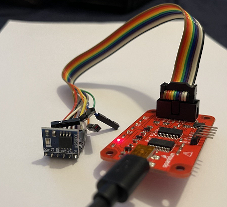
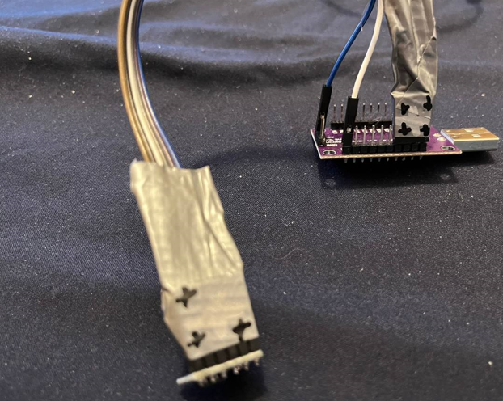
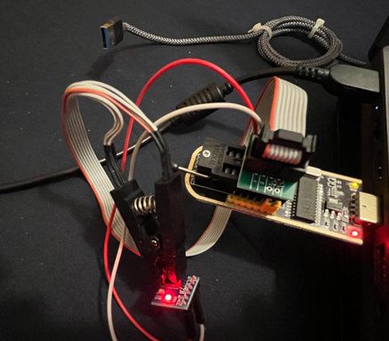

# flashrom_build_windows_x64
flashrom Dreg's fork build for windows x64 buspirate_spi, raiden_debug_spi, ft2232_spi, serprog, dediprog, developerbox, pony_spi, usbblaster_spi, pickit2_spi, ch341a_spi, ch347_spi, digilent_spi, stlinkv3_spi, dirtyjtag_spi

**NOTE: x32 build is included**

http://dangerousprototypes.com/forum/index.php?topic=10697

Source code:
- https://github.com/therealdreg/flashrom-dregmod

**WARNING**: Using bus pirate + flashrom with Virtual Machines (VM) and/or USB Hubs can cause problems. It is advisable to ALWAYS use a native OS, and connect the Bus Pirate directly to a USB port. If bus pirate console freezes(~2 mins without output)/crash : close this program, reconnect USB port and try again

**WARNING**: I recommend using a speed of approximately 100kHz for each protocol as the maximum, since the quality of the cables is important and I do not trust that the length of yours is short, especially if there is an adapter to clips, etc. The longer the cable and the more adapters there are, coupled with lower voltage, the more you will need to use a lower speed

**WARNING**: USE SHORT HIGH-QUALITY USB CABLE

btw, **flashrom works better on Linux** ;-)



## Buzzpirat & Bus Pirate help

A required `dev` parameter specifies the Bus Pirate device node and an optional `spispeed` parameter specifies the frequency of the SPI bus. The parameter delimiter is a comma. Syntax is:

```bash
flashrom -p buspirate_spi:dev=/dev/device,spispeed=frequency
```

where `frequency` can be `30k`, `125k`, `250k`, `1M`, `2M`, `2.6M`, `4M` or `8M` (in Hz). The default is the maximum frequency of 8 MHz.

The baud rate for communication between the host and the Bus Pirate can be specified with the optional `serialspeed` parameter. Syntax is:

```bash
flashrom -p buspirate_spi:serialspeed=baud
```

where `baud` can be `115200`, `230400`, `250000` or `2000000` (`2M`). The default is `2M` baud for Bus Pirate hardware version 3.0 and greater, and 115200 otherwise.

An optional pullups parameter specifies the use of the Bus Pirate internal pull-up resistors. This may be needed if you are working with a flash ROM chip that you have physically removed from the board. Syntax is:

```bash
flashrom -p buspirate_spi:pullups=state
```

where `state` can be `on` or `off`. More information about the Bus Pirate pull-up resistors and their purpose is available [in a guide by dangerousprototypes](http://dangerousprototypes.com/docs/Practical_guide_to_Bus_Pirate_pull-up_resistors).

When working with low-voltage chips, the internal 10k pull-ups of the Bus Pirate might be too high. In such cases, it’s necessary to create an external pull-up using lower-value resistors.

For this, you can use the `hiz` parameter. This way, the Bus Pirate will operate as an open drain. Syntax is:

```bash
flashrom -p buspirate_spi:hiz=state
```

where `state` can be `on` or `off`.

The state of the Bus Pirate power supply pins is controllable through an optional `psus` parameter. Syntax is:

```bash
flashrom -p buspirate_spi:psus=state
```

where `state` can be `on` or `off`. This allows the bus pirate to power the ROM chip directly. This may also be used to provide the required pullup voltage (when using the `pullups` option), by connecting the Bus Pirate’s Vpu input to the appropriate Vcc pin.

An optional aux parameter specifies the state of the Bus Pirate auxiliary pin. This may be used to drive the auxiliary pin high or low before a transfer. Syntax is:

```bash
flashrom -p buspirate_spi:aux=state
```

where `state` can be `high` or `low`. The default `state` is `high`.


## Compilation
  
```
meson setup builddir --wipe --prefer-static  --clearcache --default-library  static
meson compile -C builddir
```

## Best Firmware
Some firmwares have a bug in the binary SPI mode (like the latest community firmware) and cause problems with flashrom.
 
**I recommend using the latest Buzzpirat firmware for the Bus Pirate v3:** https://buzzpirat.com/docs/firmware-update/

## Instructions

Install drivers

Use zadig if you have problems with usb detection (google is your friend: winusb <--> libusbk) 

Try executing as Administrator

## Download 

Download last release:
- https://github.com/therealdreg/flashrom_build_windows_x64/releases

## Example of use buspirate_spi COM6 W25Q64JV-.Q:
```
flashrom.exe --progress -V -c "W25Q64JV-.Q" -p buspirate_spi:dev=COM8 -r flash_content.img
```

If the above command doesn't work (freezes), reconnect the USB Bus Pirate, and try using a slow SPI + 115200 BAUDRATE instead:
```
flashrom.exe --progress -V -c "W25Q64BV/W25Q64CV/W25Q64FV" -p buspirate_spi:dev=COM8,spispeed=250k,serialspeed=115200 -r flash_content.img
```

```
flashrom 1.4.0dev Built by Dreg rootkit.es --- on Windows 10.0 (x86_64)
flashrom is free software, get the source code at https://flashrom.org

Using clock_gettime for delay loops (clk_id: 1, resolution: 100ns).
flashrom was built with GCC 13.1.0, little endian
Command line (8 args): flashrom.exe --progress -V -c W25Q64BV/W25Q64CV/W25Q64FV -p buspirate_spi:dev=COM8,spispeed=250k,serialspeed=115200 -r flash_content.img
Initializing buspirate_spi programmer
Baud rate is 115200.
Detected Bus Pirate hardware 3.5
Detected Bus Pirate firmware 7.1
Using SPI command set v2.
SPI speed is 250kHz
Raw bitbang mode version 1
Raw SPI mode version 1
Driving AUX high.
The following protocols are supported: SPI.
Probing for Winbond W25Q64BV/W25Q64CV/W25Q64FV, 8192 kB: compare_id: id1 0xef, id2 0x4017
Added layout entry 00000000 - 007fffff named complete flash
Found Winbond flash chip "W25Q64BV/W25Q64CV/W25Q64FV" (8192 kB, SPI) on buspirate_spi.
Chip status register is 0x00.
This chip may contain one-time programmable memory. flashrom cannot read
and may never be able to write it, hence it may not be able to completely
clone the contents of this chip (see man page for details).
Reading flash... read_flash:  region (00000000..0x7fffff) is readable, reading range (00000000..0x7fffff).
[READ] 1% complete... [READ] 2% complete... [READ] 3% complete... [READ] 4% complete... [READ] 5% complete... [READ] 6% complete... [READ] 7% complete... [READ] 8% complete... [READ] 9% complete... [READ] 10% complete... [READ] 11% complete... [READ] 12% complete... [READ] 13% complete... [READ] 14% complete... [READ] 15% complete... [READ] 16% complete... [READ] 17% complete... [READ] 18% complete... [READ] 19% complete... [READ] 20% complete... [READ] 21% complete... [READ] 22% complete... [READ] 23% complete... [READ] 24% complete... [READ] 25% complete... [READ] 26% complete... [READ] 27% complete... [READ] 28% complete... [READ] 29% complete... [READ] 30% complete... [READ] 31% complete... [READ] 32% complete... [READ] 33% complete... [READ] 34% complete... [READ] 35% complete... [READ] 36% complete... [READ] 37% complete... [READ] 38% complete... [READ] 39% complete... [READ] 40% complete... [READ] 41% complete... [READ] 42% complete... [READ] 43% complete... [READ] 44% complete... [READ] 45% complete... [READ] 46% complete... [READ] 47% complete... [READ] 48% complete... [READ] 49% complete... [READ] 50% complete... [READ] 51% complete... [READ] 52% complete... [READ] 53% complete... [READ] 54% complete... [READ] 55% complete... [READ] 56% complete... [READ] 57% complete... [READ] 58% complete... [READ] 59% complete... [READ] 60% complete... [READ] 61% complete... [READ] 62% complete... [READ] 63% complete... [READ] 64% complete... [READ] 65% complete... [READ] 66% complete... [READ] 67% complete... [READ] 68% complete... [READ] 69% complete... [READ] 70% complete... [READ] 71% complete... [READ] 72% complete... [READ] 73% complete... [READ] 74% complete... [READ] 75% complete... [READ] 76% complete... [READ] 77% complete... [READ] 78% complete... [READ] 79% complete... [READ] 80% complete... [READ] 81% complete... [READ] 82% complete... [READ] 83% complete... [READ] 84% complete... [READ] 85% complete... [READ] 86% complete... [READ] 87% complete... [READ] 88% complete... [READ] 89% complete... [READ] 90% complete... [READ] 91% complete... [READ] 92% complete... [READ] 93% complete... [READ] 94% complete... [READ] 95% complete... [READ] 96% complete... [READ] 97% complete... [READ] 98% complete... [READ] 99% complete... [READ] 100% complete... done.
Raw bitbang mode version 1
Bus Pirate shutdown completed.
```

```
dreg@rootkit.es# file flash_content.img
flash_content.img: Linux rev 1.0 ext2 filesystem data, UUID=d23af33b-a804-4a75-893a-b6f469266dc7 (large files)
```

## Example FT232H W25Q64JV-.Q



```
flashrom.exe --progress -VV -c "W25Q64JV-.Q" -p ft2232_spi:type=232H -r flash_content.img
```

```
flashrom 1.4.0dev Built by Dreg rootkit.es --- on Windows 10.0 (x86_64)
flashrom is free software, get the source code at https://flashrom.org

Using clock_gettime for delay loops (clk_id: 1, resolution: 100ns).
flashrom was built with GCC 13.1.0, little endian
Command line (8 args): flashrom.exe --progress -VV -c W25Q64JV-.Q -p ft2232_spi:type=232H -r flash_content.img
Initializing ft2232_spi programmer
Using device type FTDI FT232H channel A.
Disable divide-by-5 front stage
Set clock divisor
MPSSE clock: 60.000000 MHz, divisor: 2, SPI clock: 30.000000 MHz
No loopback of TDI/DO TDO/DI
Set data bits
The following protocols are supported: SPI.
Probing for Winbond W25Q64JV-.Q, 8192 kB: compare_id: id1 0xef, id2 0x4017
Added layout entry 00000000 - 007fffff named complete flash
Found Winbond flash chip "W25Q64JV-.Q" (8192 kB, SPI) on ft2232_spi.
Chip status register is 0x02.
This chip may contain one-time programmable memory. flashrom cannot read
and may never be able to write it, hence it may not be able to completely
clone the contents of this chip (see man page for details).
===
This flash part has status UNTESTED for operations: WP
The test status of this chip may have been updated in the latest development
version of flashrom. If you are running the latest development version,
please email a report to flashrom@flashrom.org if any of the above operations
work correctly for you with this flash chip. Please include the flashrom log
file for all operations you tested (see the man page for details), and mention
which mainboard or programmer you tested in the subject line.
Thanks for your help!
write_wp_bits: wp_verify reg:1 value:0x2
write_wp_bits: wp_verify reg:2 value:0x0
write_wp_bits: wp_verify reg:3 value:0xff
write_wp_bits: wp_verify failed: reg:3 actual:0x4 expected:0x0
Failed to unlock flash status reg with wp support.
Block protection is disabled.
Reading flash... read_flash:  region (00000000..0x7fffff) is readable, reading range (00000000..0x7fffff).
[READ] 1% complete... [READ] 2% complete... [READ] 3% complete... [READ] 4% complete... [READ] 5% complete... [READ] 6% complete... [READ] 7% complete... [READ] 8% complete... [READ] 9% complete... [READ] 10% complete... [READ] 11% complete... [READ] 12% complete... [READ] 13% complete... [READ] 14% complete... [READ] 15% complete... [READ] 16% complete... [READ] 17% complete... [READ] 18% complete... [READ] 19% complete... [READ] 20% complete... [READ] 21% complete... [READ] 22% complete... [READ] 23% complete... [READ] 24% complete... [READ] 25% complete... [READ] 26% complete... [READ] 27% complete... [READ] 28% complete... [READ] 29% complete... [READ] 30% complete... [READ] 31% complete... [READ] 32% complete... [READ] 33% complete... [READ] 34% complete... [READ] 35% complete... [READ] 36% complete... [READ] 37% complete... [READ] 38% complete... [READ] 39% complete... [READ] 40% complete... [READ] 41% complete... [READ] 42% complete... [READ] 43% complete... [READ] 44% complete... [READ] 45% complete... [READ] 46% complete... [READ] 47% complete... [READ] 48% complete... [READ] 49% complete... [READ] 50% complete... [READ] 51% complete... [READ] 52% complete... [READ] 53% complete... [READ] 54% complete... [READ] 55% complete... [READ] 56% complete... [READ] 57% complete... [READ] 58% complete... [READ] 59% complete... [READ] 60% complete... [READ] 61% complete... [READ] 62% complete... [READ] 63% complete... [READ] 64% complete... [READ] 65% complete... [READ] 66% complete... [READ] 67% complete... [READ] 68% complete... [READ] 69% complete... [READ] 70% complete... [READ] 71% complete... [READ] 72% complete... [READ] 73% complete... [READ] 74% complete... [READ] 75% complete... [READ] 76% complete... [READ] 77% complete... [READ] 78% complete... [READ] 79% complete... [READ] 80% complete... [READ] 81% complete... [READ] 82% complete... [READ] 83% complete... [READ] 84% complete... [READ] 85% complete... [READ] 86% complete... [READ] 87% complete... [READ] 88% complete... [READ] 89% complete... [READ] 90% complete... [READ] 91% complete... [READ] 92% complete... [READ] 93% complete... [READ] 94% complete... [READ] 95% complete... [READ] 96% complete... [READ] 97% complete... [READ] 98% complete... [READ] 99% complete... [READ] 100% complete... done.
write_wp_bits: wp_verify reg:1 value:0x2
write_wp_bits: wp_verify reg:2 value:0x0
write_wp_bits: wp_verify reg:3 value:0xff
write_wp_bits: wp_verify failed: reg:3 actual:0x4 expected:0x0
Releasing I/Os
```

## Example CH341A W25Q64JV-.Q (with clip)



```
flashrom.exe --progress -VV -c "W25Q64JV-.Q" -p ch341a_spi -r flash_content.img
```

```
flashrom 1.4.0dev Built by Dreg rootkit.es --- on Windows 10.0 (x86_64)
flashrom is free software, get the source code at https://flashrom.org

Using clock_gettime for delay loops (clk_id: 1, resolution: 100ns).
flashrom was built with GCC 13.1.0, little endian
Command line (8 args): flashrom.exe --progress -VV -c W25Q64JV-.Q -p ch341a_spi -r flash_content.img
Initializing ch341a_spi programmer
Cannot detach the existing USB driver. Claiming the interface may fail. LIBUSB_ERROR_NOT_SUPPORTED
Device revision is 3.0.4
The following protocols are supported: SPI.
Probing for Winbond W25Q64JV-.Q, 8192 kB: compare_id: id1 0xef, id2 0x4017
Added layout entry 00000000 - 007fffff named complete flash
Found Winbond flash chip "W25Q64JV-.Q" (8192 kB, SPI) on ch341a_spi.
Chip status register is 0x00.
This chip may contain one-time programmable memory. flashrom cannot read
and may never be able to write it, hence it may not be able to completely
clone the contents of this chip (see man page for details).
===
This flash part has status UNTESTED for operations: WP
The test status of this chip may have been updated in the latest development
version of flashrom. If you are running the latest development version,
please email a report to flashrom@flashrom.org if any of the above operations
work correctly for you with this flash chip. Please include the flashrom log
file for all operations you tested (see the man page for details), and mention
which mainboard or programmer you tested in the subject line.
Thanks for your help!
write_wp_bits: wp_verify reg:1 value:0x0
write_wp_bits: wp_verify reg:2 value:0x0
write_wp_bits: wp_verify reg:3 value:0x0
write_wp_bits: wp_verify reg:1 value:0x0
write_wp_bits: wp_verify reg:2 value:0x0
write_wp_bits: wp_verify reg:3 value:0x0
Reading flash... read_flash:  region (00000000..0x7fffff) is readable, reading range (00000000..0x7fffff).
[READ] 1% complete... [READ] 2% complete... [READ] 3% complete... [READ] 4% complete... [READ] 5% complete... [READ] 6% complete... [READ] 7% complete... [READ] 8% complete... [READ] 9% complete... [READ] 10% complete... [READ] 11% complete... [READ] 12% complete... [READ] 13% complete... [READ] 14% complete... [READ] 15% complete... [READ] 16% complete... [READ] 17% complete... [READ] 18% complete... [READ] 19% complete... [READ] 20% complete... [READ] 21% complete... [READ] 22% complete... [READ] 23% complete... [READ] 24% complete... [READ] 25% complete... [READ] 26% complete... [READ] 27% complete... [READ] 28% complete... [READ] 29% complete... [READ] 30% complete... [READ] 31% complete... [READ] 32% complete... [READ] 33% complete... [READ] 34% complete... [READ] 35% complete... [READ] 36% complete... [READ] 37% complete... [READ] 38% complete... [READ] 39% complete... [READ] 40% complete... [READ] 41% complete... [READ] 42% complete... [READ] 43% complete... [READ] 44% complete... [READ] 45% complete... [READ] 46% complete... [READ] 47% complete... [READ] 48% complete... [READ] 49% complete... [READ] 50% complete... [READ] 51% complete... [READ] 52% complete... [READ] 53% complete... [READ] 54% complete... [READ] 55% complete... [READ] 56% complete... [READ] 57% complete... [READ] 58% complete... [READ] 59% complete... [READ] 60% complete... [READ] 61% complete... [READ] 62% complete... [READ] 63% complete... [READ] 64% complete... [READ] 65% complete... [READ] 66% complete... [READ] 67% complete... [READ] 68% complete... [READ] 69% complete... [READ] 70% complete... [READ] 71% complete... [READ] 72% complete... [READ] 73% complete... [READ] 74% complete... [READ] 75% complete... [READ] 76% complete... [READ] 77% complete... [READ] 78% complete... [READ] 79% complete... [READ] 80% complete... [READ] 81% complete... [READ] 82% complete... [READ] 83% complete... [READ] 84% complete... [READ] 85% complete... [READ] 86% complete... [READ] 87% complete... [READ] 88% complete... [READ] 89% complete... [READ] 90% complete... [READ] 91% complete... [READ] 92% complete... [READ] 93% complete... [READ] 94% complete... [READ] 95% complete... [READ] 96% complete... [READ] 97% complete... [READ] 98% complete... [READ] 99% complete... [READ] 100% complete... done.
write_wp_bits: wp_verify reg:1 value:0x0
write_wp_bits: wp_verify reg:2 value:0x0
write_wp_bits: wp_verify reg:3 value:0x0
write_wp_bits: wp_verify reg:1 value:0x0
write_wp_bits: wp_verify reg:2 value:0x0
write_wp_bits: wp_verify reg:3 value:0x0
``` 


## Supported programmers

```
Supported programmers:
dummy, raiden_debug_spi, ft2232_spi, serprog, buspirate_spi, dediprog,
developerbox, pony_spi, usbblaster_spi, pickit2_spi, ch341a_spi, ch347_spi,
digilent_spi, stlinkv3_spi, dirtyjtag_spi

Supported devices for the dummy programmer:
Dummy device, does nothing and logs all accesses

Supported USB devices for the raiden_debug_spi programmer:
Vendor  Device   USB IDs    Status

Supported USB devices for the ft2232_spi programmer:
Vendor   Device                              USB IDs    Status
FTDI     FT2232H                             0403:6010  OK
FTDI     FT4232H                             0403:6011  OK
FTDI     FT232H                              0403:6014  OK
FTDI     FT4233H                             0403:6041  OK
TIAO     USB Multi-Protocol Adapter          0403:8a98  OK
TIAO     USB Multi-Protocol Adapter Lite     0403:8a99  OK
Kristech KT-LINK                             0403:bbe2  OK
Amontec  JTAGkey                             0403:cff8  OK
GOEPEL   PicoTAP                             096c:1449  OK
Google   Servo                               18d1:5001  OK
Google   Servo V2 Legacy                     18d1:5002  OK
Google   Servo V2                            18d1:5003  OK
FIC      OpenMoko Neo1973 Debug board (V2+)  1457:5118  OK
Olimex   ARM-USB-OCD                         15ba:0003  OK
Olimex   ARM-USB-TINY                        15ba:0004  OK
Olimex   ARM-USB-OCD-H                       15ba:002b  OK
Olimex   ARM-USB-TINY-H                      15ba:002a  OK

Supported devices for the serprog programmer:
All programmer devices speaking the serprog protocol

Supported devices for the buspirate_spi programmer:
Dangerous Prototypes Bus Pirate

Supported USB devices for the dediprog programmer:
Vendor   Device             USB IDs    Status
Dediprog SF100/SF200/SF600  0483:dada  OK

Supported USB devices for the developerbox programmer:
Vendor       Device                                 USB IDs    Status
Silicon Labs CP2102N USB to UART Bridge Controller  10c4:ea60  OK

Supported devices for the pony_spi programmer:
Programmers compatible with SI-Prog, serbang or AJAWe

Supported USB devices for the usbblaster_spi programmer:
Vendor  Device       USB IDs    Status
Altera  USB-Blaster  09fb:6001  OK

Supported USB devices for the pickit2_spi programmer:
Vendor    Device    USB IDs    Status
Microchip PICkit 2  04d8:0033  OK

Supported USB devices for the ch341a_spi programmer:
Vendor            Device   USB IDs    Status
Winchiphead (WCH) CH341A   1a86:5512  OK

Supported USB devices for the ch347_spi programmer:
Vendor              Device               USB IDs    Status
QinHeng Electronics USB To UART+SPI+I2C  1a86:55db  OK

Supported USB devices for the digilent_spi programmer:
Vendor   Device                  USB IDs    Status
Digilent Development board JTAG  1443:0007  OK

Supported USB devices for the stlinkv3_spi programmer:
Vendor             Device              USB IDs    Status
STMicroelectronics STLINK-V3E          0483:374e  Untested
STMicroelectronics STLINK-V3S          0483:374f  OK
STMicroelectronics STLINK-V3 dual VCP  0483:3753  OK
STMicroelectronics STLINK-V3 no MSD    0483:3754  Untested

Supported USB devices for the dirtyjtag_spi programmer:
Vendor    Device      USB IDs    Status
DirtyJTAG JTAG probe  1209:c0ca  OK
```

## Supported ICs

```
Vendor                       Device                               Test  Known   Size   Type      
                                                                  OK    Broken  [kB]             

(P = PROBE, R = READ, E = ERASE, W = WRITE, - = N/A)

AMD                          Am29F002(N)BB                                        256  Parallel  
AMD                          Am29F002(N)BT                                        256  Parallel  
AMD                          Am29F010                                             128  Parallel  
AMD                          Am29F010A/B                          PRE             128  Parallel  
AMD                          Am29F016D                                           2048  Parallel  
AMD                          Am29F040                                             512  Parallel  
AMD                          Am29F040B                                            512  Parallel  
AMD                          Am29F080                                            1024  Parallel  
AMD                          Am29F080B                                           1024  Parallel  
AMD                          Am29LV001BB                          PREW            128  Parallel  
AMD                          Am29LV001BT                                          128  Parallel  
AMD                          Am29LV002BB                                          256  Parallel  
AMD                          Am29LV002BT                                          256  Parallel  
AMD                          Am29LV004BB                                          512  Parallel  
AMD                          Am29LV004BT                                          512  Parallel  
AMD                          Am29LV008BB                          PREW           1024  Parallel  
AMD                          Am29LV008BT                                         1024  Parallel  
AMD                          Am29LV040B                           PREW            512  Parallel  
AMD                          Am29LV081B                                          1024  Parallel  
AMIC                         A25L010                                              128  SPI       
AMIC                         A25L016                                             2048  SPI       
AMIC                         A25L020                                              256  SPI       
AMIC                         A25L032                              PREW           4096  SPI       
AMIC                         A25L040                                              512  SPI       
AMIC                         A25L05PT                                              64  SPI       
AMIC                         A25L05PU                                              64  SPI       
AMIC                         A25L080                                             1024  SPI       
AMIC                         A25L10PT                                             128  SPI       
AMIC                         A25L10PU                                             128  SPI       
AMIC                         A25L16PT                                            2048  SPI       
AMIC                         A25L16PU                             PR             2048  SPI       
AMIC                         A25L20PT                                             256  SPI       
AMIC                         A25L20PU                                             256  SPI       
AMIC                         A25L40PT                             PR              512  SPI       
AMIC                         A25L40PU                             PREW            512  SPI       
AMIC                         A25L512                                               64  SPI       
AMIC                         A25L80P                              PRE            1024  SPI       
AMIC                         A25LQ032/                                           4096  SPI       
                             A25LQ32A
AMIC                         A25LQ16                                             2048  SPI       
AMIC                         A25LQ64                                             8192  SPI       
AMIC                         A29002B                                              256  Parallel  
AMIC                         A29002T                              PREW            256  Parallel  
AMIC                         A29040B                              PREW            512  Parallel  
AMIC                         A49LF040A                            PR              512  LPC       
Atmel                        AT25DF011                            PREW            128  SPI       
Atmel                        AT25DF021                                            256  SPI       
Atmel                        AT25DF021A                           PREW            256  SPI       
Atmel                        AT25DF041A                           PREW            512  SPI       
Atmel                        AT25DF081                                           1024  SPI       
Atmel                        AT25DF081A                                          1024  SPI       
Atmel                        AT25DF161                            PREW           2048  SPI       
Atmel                        AT25DF321                            PREW           4096  SPI       
Atmel                        AT25DF321A                           PREW           4096  SPI       
Atmel                        AT25DF641(A)                         PREW           8192  SPI       
Atmel                        AT25DL081                                           1024  SPI       
Atmel                        AT25DL161                                           2048  SPI       
Atmel                        AT25DQ161                                           2048  SPI       
Atmel                        AT25F1024(A)                         PREW            128  SPI       
Atmel                        AT25F2048                                            256  SPI       
Atmel                        AT25F4096                            PREW            512  SPI       
Atmel                        AT25F512                             PREW             64  SPI       
Atmel                        AT25F512A                            PREW             64  SPI       
Atmel                        AT25F512B                                             64  SPI       
Atmel                        AT25FS010                            PREW            128  SPI       
Atmel                        AT25FS040                                            512  SPI       
Atmel                        AT25SF041                            PREW            512  SPI       
Atmel                        AT25SF081                            PREW           1024  SPI       
Atmel                        AT25SF128A                           PR            16384  SPI       
Atmel                        AT25SF161                            PREW           2048  SPI       
Atmel                        AT25SF321                            PR             4096  SPI       
Atmel                        AT25SL128A                           PREW          16384  SPI       
Atmel                        AT26DF041                            PREW            512  SPI       
Atmel                        AT26DF081A                           PREW           1024  SPI       
Atmel                        AT26DF161                            PREW           2048  SPI       
Atmel                        AT26DF161A                           PREW           2048  SPI       
Atmel                        AT26F004                                      W      512  SPI       
Atmel                        AT29C010A                            PREW            128  Parallel  
Atmel                        AT29C020                             PREW            256  Parallel  
Atmel                        AT29C040A                                            512  Parallel  
Atmel                        AT29C512                             PREW             64  Parallel  
Atmel                        AT45CS1282                                         16896  SPI       
Atmel                        AT45DB011D                           PREW            128  SPI       
Atmel                        AT45DB021D                           PREW            256  SPI       
Atmel                        AT45DB041D                           PREW            512  SPI       
Atmel                        AT45DB081D                           PREW           1024  SPI       
Atmel                        AT45DB161D                           PREW           2048  SPI       
Atmel                        AT45DB321C                                          4224  SPI       
Atmel                        AT45DB321D                           PREW           4096  SPI       
Atmel                        AT45DB321E                                          4096  SPI       
Atmel                        AT45DB642D                           PREW           8192  SPI       
Atmel                        AT49(H)F010                          PREW            128  Parallel  
Atmel                        AT49BV512                            PREW             64  Parallel  
Atmel                        AT49F002(N)                                          256  Parallel  
Atmel                        AT49F002(N)T                         PR              256  Parallel  
Atmel                        AT49F020                             PRE             256  Parallel  
Atmel                        AT49F040                                             512  Parallel  
Atmel                        AT49F080                                            1024  Parallel  
Atmel                        AT49F080T                                           1024  Parallel  
Atmel                        AT49LH002                                            256  LPC, FWH  
Atmel                        AT49LH004                                            512  LPC, FWH  
Atmel                        AT49LH00B4                                           512  LPC, FWH  
Boya/                        B.25D16A                             PR             2048  SPI       
BoHong Microelectronics      
Boya/                        B.25D80A                             PR             1024  SPI       
BoHong Microelectronics      
Boya/                        B.25Q128AS                           PREW          16384  SPI       
BoHong Microelectronics      
Bright                       BM29F040                             PR              512  Parallel  
Catalyst                     CAT28F512                            PR      EW       64  Parallel  
ENE                          KB9012 (EDI)                         PREW            128  SPI       
ESI                          ES25P16                                             2048  SPI       
ESI                          ES25P40                                              512  SPI       
ESI                          ES25P80                                             1024  SPI       
ESMT                         F25L008A                             PREW           1024  SPI       
ESMT                         F25L32PA                                            4096  SPI       
ESMT                         F49B002UA                                            256  Parallel  
Eon                          EN25B05                                               64  SPI       
Eon                          EN25B05T                                              64  SPI       
Eon                          EN25B10                                              128  SPI       
Eon                          EN25B10T                             PREW            128  SPI       
Eon                          EN25B16                                             2048  SPI       
Eon                          EN25B16T                                            2048  SPI       
Eon                          EN25B20                                              256  SPI       
Eon                          EN25B20T                                             256  SPI       
Eon                          EN25B32                                             4096  SPI       
Eon                          EN25B32T                                            4096  SPI       
Eon                          EN25B40                                              512  SPI       
Eon                          EN25B40T                                             512  SPI       
Eon                          EN25B64                                             8192  SPI       
Eon                          EN25B64T                                            8192  SPI       
Eon                          EN25B80                                             1024  SPI       
Eon                          EN25B80T                                            1024  SPI       
Eon                          EN25F05                              PREW             64  SPI       
Eon                          EN25F10                              PREW            128  SPI       
Eon                          EN25F16                              PREW           2048  SPI       
Eon                          EN25F20                                              256  SPI       
Eon                          EN25F32                              PREW           4096  SPI       
Eon                          EN25F40                              PREW            512  SPI       
Eon                          EN25F64                              PREW           8192  SPI       
Eon                          EN25F80                              PREW           1024  SPI       
Eon                          EN25P05                                               64  SPI       
Eon                          EN25P10                                              128  SPI       
Eon                          EN25P16                                             2048  SPI       
Eon                          EN25P20                                              256  SPI       
Eon                          EN25P32                                             4096  SPI       
Eon                          EN25P40                                              512  SPI       
Eon                          EN25P64                                             8192  SPI       
Eon                          EN25P80                                             1024  SPI       
Eon                          EN25Q128                             PREW          16384  SPI       
Eon                          EN25Q16                                             2048  SPI       
Eon                          EN25Q32(A/B)                         PREW           4096  SPI       
Eon                          EN25Q40                                              512  SPI       
Eon                          EN25Q64                              PREW           8192  SPI       
Eon                          EN25Q80(A)                                          1024  SPI       
Eon                          EN25QH128                            PREW          16384  SPI       
Eon                          EN25QH16                             PREW           2048  SPI       
Eon                          EN25QH32                             PREW           4096  SPI       
Eon                          EN25QH32B                            PREW           4096  SPI       
Eon                          EN25QH64                             PREW           8192  SPI       
Eon                          EN25QH64A                            PREW           8192  SPI       
Eon                          EN25S10                                              128  SPI       
Eon                          EN25S16                                             2048  SPI       
Eon                          EN25S20                                              256  SPI       
Eon                          EN25S32                                             4096  SPI       
Eon                          EN25S40                              PREW            512  SPI       
Eon                          EN25S64                              PREW           8192  SPI       
Eon                          EN25S80                                             1024  SPI       
Eon                          EN29F002(A)(N)B                      PREW            256  Parallel  
Eon                          EN29F002(A)(N)T                      PREW            256  Parallel  
Eon                          EN29F010                             PRE             128  Parallel  
Eon                          EN29GL064(A)B                                       8192  Parallel  
Eon                          EN29GL064(A)T                                       8192  Parallel  
Eon                          EN29GL064H/L                                        8192  Parallel  
Eon                          EN29GL128                                          16384  Parallel  
Eon                          EN29LV040(A)                         PREW            512  Parallel  
Eon                          EN29LV640B                           PREW           8192  Parallel  
Fudan                        FM25F005                                              64  SPI       
Fudan                        FM25F01                              PREW            128  SPI       
Fudan                        FM25F02(A)                                           256  SPI       
Fudan                        FM25F04(A)                                           512  SPI       
Fudan                        FM25Q08                                             1024  SPI       
Fudan                        FM25Q16                                             2048  SPI       
Fudan                        FM25Q32                                             4096  SPI       
Fujitsu                      MBM29F004BC                                          512  Parallel  
Fujitsu                      MBM29F004TC                                          512  Parallel  
Fujitsu                      MBM29F400BC                                          512  Parallel  
Fujitsu                      MBM29F400TC                                          512  Parallel  
Fujitsu                      MBM29LV160BE                                        2048  Parallel  
Fujitsu                      MBM29LV160TE                                        2048  Parallel  
GigaDevice                   GD25B128B/                           PREW          16384  SPI       
                             GD25Q128B
GigaDevice                   GD25LQ128C/                          PREW          16384  SPI       
                             GD25LQ128D/
                             GD25LQ128E
GigaDevice                   GD25LQ16                                            2048  SPI       
GigaDevice                   GD25LQ32                             PREW           4096  SPI       
GigaDevice                   GD25LQ40                                             512  SPI       
GigaDevice                   GD25LQ64(B)                          PREW           8192  SPI       
GigaDevice                   GD25LQ80                                            1024  SPI       
GigaDevice                   GD25Q10                                              128  SPI       
GigaDevice                   GD25Q127C/                           PREW          16384  SPI       
                             GD25Q128E
GigaDevice                   GD25Q128C                            PREW          16384  SPI       
GigaDevice                   GD25Q16(B)                           PREW           2048  SPI       
GigaDevice                   GD25Q20(B)                           PREW            256  SPI       
GigaDevice                   GD25Q256D/                           PREW          32768  SPI       
                             GD25Q256E
GigaDevice                   GD25Q32(B)                           PREW           4096  SPI       
GigaDevice                   GD25Q40(B)                           PREW            512  SPI       
GigaDevice                   GD25Q512                             PREW             64  SPI       
GigaDevice                   GD25Q64(B)                           PREW           8192  SPI       
GigaDevice                   GD25Q80(B)                           PREW           1024  SPI       
GigaDevice                   GD25T80                                             1024  SPI       
GigaDevice                   GD25VQ16C                                           2048  SPI       
GigaDevice                   GD25VQ21B                                            256  SPI       
GigaDevice                   GD25VQ40C                                            512  SPI       
GigaDevice                   GD25VQ41B                            PREW            512  SPI       
GigaDevice                   GD25VQ80C                                           1024  SPI       
GigaDevice                   GD25WQ80E                            PREW           1024  SPI       
Hyundai                      HY29F002B                                            256  Parallel  
Hyundai                      HY29F002T                            PRE             256  Parallel  
Hyundai                      HY29F040A                                            512  Parallel  
ISSI                         IS25LP016                            PREW           2048  SPI       
ISSI                         IS25LP064                            PREW           8192  SPI       
ISSI                         IS25LP128                            PREW          16384  SPI       
ISSI                         IS25LP256                            PREW          32768  SPI       
ISSI                         IS25LQ016                            PREW           2048  SPI       
ISSI                         IS25WP016                            PREW           2048  SPI       
ISSI                         IS25WP020                                            256  SPI       
ISSI                         IS25WP032                                           4096  SPI       
ISSI                         IS25WP040                                            512  SPI       
ISSI                         IS25WP064                            PREW           8192  SPI       
ISSI                         IS25WP080                            PREW           1024  SPI       
ISSI                         IS25WP128                            PREW          16384  SPI       
ISSI                         IS25WP256                            PREW          32768  SPI       
ISSI                         IS25WQ040                            PREW            512  SPI       
ISSI                         IS29GL064B                                          8192  Parallel  
ISSI                         IS29GL064H/L                                        8192  Parallel  
ISSI                         IS29GL064T                                          8192  Parallel  
ISSI                         IS29GL128H/L                                       16384  Parallel  
Intel                        25F160S33B8                                         2048  SPI       
Intel                        25F160S33T8                                         2048  SPI       
Intel                        25F320S33B8                                         4096  SPI       
Intel                        25F320S33T8                                         4096  SPI       
Intel                        25F640S33B8                          PREW           8192  SPI       
Intel                        25F640S33T8                                         8192  SPI       
Intel                        28F001BN/BX-B                                        128  Parallel  
Intel                        28F001BN/BX-T                        PREW            128  Parallel  
Intel                        28F002BC/BL/BV/BX-T                  PRE             256  Parallel  
Intel                        28F004B5/BE/BV/BX-B                                  512  Parallel  
Intel                        28F004B5/BE/BV/BX-T                                  512  Parallel  
Intel                        28F008S3/S5/SC                                       512  Parallel  
Intel                        28F400BV/BX/CE/CV-B                                  512  Parallel  
Intel                        28F400BV/BX/CE/CV-T                                  512  Parallel  
Intel                        AT82802AB                            PREW            512  FWH       
Intel                        82802AC                              PR             1024  FWH       
Macronix                     MX23L12854                             --          16384  SPI       
Macronix                     MX23L1654                              --           2048  SPI       
Macronix                     MX23L3254                            PR--           4096  SPI       
Macronix                     MX23L6454                            PR--           8192  SPI       
Macronix                     MX25L1005(C)/                        PREW            128  SPI       
                             MX25L1006E
Macronix                     MX25L12805D                          PREW          16384  SPI       
Macronix                     MX25L12833F/                         PREW          16384  SPI       
                             MX25L12835F/
                             MX25L12845E/
                             MX25L12865E/
                             MX25L12873F
Macronix                     MX25L1605                            PREW           2048  SPI       
Macronix                     MX25V16066                           PR             2048  SPI       
Macronix                     MX25L1605A/                          PREW           2048  SPI       
                             MX25L1606E/
                             MX25L1608E
Macronix                     MX25L1605D/                          PREW           2048  SPI       
                             MX25L1608D/
                             MX25L1673E
Macronix                     MX25L1635D                           PREW           2048  SPI       
Macronix                     MX25L1635E                                          2048  SPI       
Macronix                     MX25L2005(C)/                        PREW            256  SPI       
                             MX25L2006E
Macronix                     MX25L25635F/                         PREW          32768  SPI       
                             MX25L25645G
Macronix                     MX25L3205(A)                         PREW           4096  SPI       
Macronix                     MX25L3205D/                          PREW           4096  SPI       
                             MX25L3208D
Macronix                     MX25L3206E/                          PREW           4096  SPI       
                             MX25L3208E
Macronix                     MX25L3235D                                          4096  SPI       
Macronix                     MX25L3233F/                          PREW           4096  SPI       
                             MX25L3273E
Macronix                     MX25L3255E                           PREW           4096  SPI       
Macronix                     MX25L4005(A/C)/                      PREW            512  SPI       
                             MX25L4006E
Macronix                     MX25L512(E)/                         PREW             64  SPI       
                             MX25V512(C)
Macronix                     MX25L5121E                           PREW             64  SPI       
Macronix                     MX25L6405                            PREW           8192  SPI       
Macronix                     MX25L6405D                           PREW           8192  SPI       
Macronix                     MX25L6406E/                          PREW           8192  SPI       
                             MX25L6408E
Macronix                     MX25L6436E/                          PREW           8192  SPI       
                             MX25L6445E/
                             MX25L6465E
Macronix                     MX25L6473E                           PREW           8192  SPI       
Macronix                     MX25L6473F                           PREW           8192  SPI       
Macronix                     MX25L6495F                           PREW           8192  SPI       
Macronix                     MX25L8005/                           PREW           1024  SPI       
                             MX25L8006E/
                             MX25L8008E/
                             MX25V8005
Macronix                     MX25R3235F                           PREW           4096  SPI       
Macronix                     MX25R6435F                           PREW           8192  SPI       
Macronix                     MX25V4035F                                           512  SPI       
Macronix                     MX25V8035F                                          1024  SPI       
Macronix                     MX25V1635F                           PREW           2048  SPI       
Macronix                     MX25U12835F                          PREW          16384  SPI       
Macronix                     MX25U1635E                           PR             2048  SPI       
Macronix                     MX25U25635F                          PREW          32768  SPI       
Macronix                     MX25U25643G                          PREW          32768  SPI       
Macronix                     MX25U3235E/F                         PREW           4096  SPI       
Macronix                     MX25U51245G                          PREW          65536  SPI       
Macronix                     MX25U6435E/F                         PREW           8192  SPI       
Macronix                     MX25U8032E                           PREW           1024  SPI       
Macronix                     MX29F001B                                            128  Parallel  
Macronix                     MX29F001T                            PREW            128  Parallel  
Macronix                     MX29F002(N)B                                         256  Parallel  
Macronix                     MX29F002(N)T                         PREW            256  Parallel  
Macronix                     MX29F022(N)B                                         256  Parallel  
Macronix                     MX29F022(N)T                         PREW            256  Parallel  
Macronix                     MX29F040                                             512  Parallel  
Macronix                     MX29GL128F                                         16384  Parallel  
Macronix                     MX29GL320EB                                         4096  Parallel  
Macronix                     MX29GL320EH/L                                       4096  Parallel  
Macronix                     MX29GL320ET                                         4096  Parallel  
Macronix                     MX29GL640EB                                         8192  Parallel  
Macronix                     MX29GL640EH/L                                       8192  Parallel  
Macronix                     MX29GL640ET                                         8192  Parallel  
Macronix                     MX29LV040                                            512  Parallel  
Macronix                     MX66L51235F/                         PREW          65536  SPI       
                             MX25L51245G
Macronix                     MX66L1G45G                           PREW         131072  SPI       
Macronix                     MX77L25650F                          PREW          32768  SPI       
Micron/                      M25P05                                                64  SPI       
Numonyx/ST                   
Micron/                      M25P05-A                             PREW             64  SPI       
Numonyx/ST                   
Micron/                      M25P10                                               128  SPI       
Numonyx/ST                   
Micron/                      M25P10-A                             PREW            128  SPI       
Numonyx/ST                   
Micron/                      M25P128                              PREW          16384  SPI       
Numonyx/ST                   
Micron/                      M25P16                               PREW           2048  SPI       
Numonyx/ST                   
Micron/                      M25P20                                               256  SPI       
Numonyx/ST                   
Micron/                      M25P20-old                           PREW            256  SPI       
Numonyx/ST                   
Micron/                      M25P32                               PREW           4096  SPI       
Numonyx/ST                   
Micron/                      M25P40                               PREW            512  SPI       
Numonyx/ST                   
Micron/                      M25P40-old                                           512  SPI       
Numonyx/ST                   
Micron/                      M25P64                               PREW           8192  SPI       
Numonyx/ST                   
Micron/                      M25P80                               PREW           1024  SPI       
Numonyx/ST                   
Micron/                      M25PE10                                              128  SPI       
Numonyx/ST                   
Micron/                      M25PE16                                             2048  SPI       
Numonyx/ST                   
Micron/                      M25PE20                                              256  SPI       
Numonyx/ST                   
Micron/                      M25PE40                              PREW            512  SPI       
Numonyx/ST                   
Micron/                      M25PE80                              PREW           1024  SPI       
Numonyx/ST                   
Micron/                      M25PX16                              PREW           2048  SPI       
Numonyx/ST                   
Micron/                      M25PX32                              PRE            4096  SPI       
Numonyx/ST                   
Micron/                      M25PX64                              PREW           8192  SPI       
Numonyx/ST                   
Micron/                      M25PX80                              PREW           1024  SPI       
Numonyx/ST                   
Micron/                      M45PE10                                              128  SPI       
Numonyx/ST                   
Micron/                      M45PE16                                             2048  SPI       
Numonyx/ST                   
Micron/                      M45PE20                                              256  SPI       
Numonyx/ST                   
Micron/                      M45PE40                                              512  SPI       
Numonyx/ST                   
Micron/                      M45PE80                                             1024  SPI       
Numonyx/ST                   
Micron/                      N25Q00A..1G                                       131072  SPI       
Numonyx/ST                   
Micron/                      N25Q00A..3G                                       131072  SPI       
Numonyx/ST                   
Micron/                      N25Q016                                             2048  SPI       
Numonyx/ST                   
Micron/                      N25Q032..1E                                         4096  SPI       
Numonyx/ST                   
Micron/                      N25Q032..3E                          PREW           4096  SPI       
Numonyx/ST                   
Micron/                      N25Q064..1E                          PREW           8192  SPI       
Numonyx/ST                   
Micron/                      N25Q064..3E                          PREW           8192  SPI       
Numonyx/ST                   
Micron/                      N25Q128..1E                          PREW          16384  SPI       
Numonyx/ST                   
Micron/                      N25Q128..3E                          PREW          16384  SPI       
Numonyx/ST                   
Micron/                      N25Q256..1E                                        32768  SPI       
Numonyx/ST                   
Micron/                      N25Q256..3E                                        32768  SPI       
Numonyx/ST                   
Micron/                      N25Q512..1G                                        65536  SPI       
Numonyx/ST                   
Micron/                      N25Q512..3G                          PREW          65536  SPI       
Numonyx/ST                   
Micron                       MT25QL01G                            PREW         131072  SPI       
Micron                       MT25QU01G                                         131072  SPI       
Micron                       MT25QL02G                                         262144  SPI       
Micron                       MT25QU02G                                         262144  SPI       
Micron                       MT25QU128                                          16384  SPI       
Micron                       MT25QL128                            PREW          16384  SPI       
Micron                       MT25QL256                            PREW          32768  SPI       
Micron                       MT25QU256                            PREW          32768  SPI       
Micron                       MT25QL512                            PREW          65536  SPI       
Micron                       MT25QU512                            PREW          65536  SPI       
MoselVitelic                 V29C51000B                                            64  Parallel  
MoselVitelic                 V29C51000T                                            64  Parallel  
MoselVitelic                 V29C51400B                                           512  Parallel  
MoselVitelic                 V29C51400T                                           512  Parallel  
MoselVitelic                 V29LC51000                                            64  Parallel  
MoselVitelic                 V29LC51001                                           128  Parallel  
MoselVitelic                 V29LC51002                                           256  Parallel  
Nantronics                   N25S10                                               128  SPI       
Nantronics                   N25S16                                              2048  SPI       
Nantronics                   N25S20                                               256  SPI       
Nantronics                   N25S40                                               512  SPI       
Nantronics                   N25S80                                              1024  SPI       
PMC                          Pm25LD010(C)                         PREW            128  SPI       
PMC                          Pm25LD020(C)                         PREW            256  SPI       
PMC                          Pm25LD040(C)                         PREW            512  SPI       
PMC                          Pm25LD256C                                            32  SPI       
PMC                          Pm25LD512(C)                         PREW             64  SPI       
PMC                          Pm25LQ016                                           2048  SPI       
PMC                          Pm25LQ020                                            256  SPI       
PMC                          Pm25LQ032C                           PREW           4096  SPI       
PMC                          Pm25LQ040                                            512  SPI       
PMC                          Pm25LQ080                                           1024  SPI       
PMC                          Pm25LV010                            PREW            128  SPI       
PMC                          Pm25LV010A                           PREW            128  SPI       
PMC                          Pm25LV016B                                          2048  SPI       
PMC                          Pm25LV020                                            256  SPI       
PMC                          Pm25LV040                            PREW            512  SPI       
PMC                          Pm25LV080B                                          1024  SPI       
PMC                          Pm25LV512(A)                         PREW             64  SPI       
PMC                          Pm29F002B                                            256  Parallel  
PMC                          Pm29F002T                            PREW            256  Parallel  
PMC                          Pm39LV010                            PREW            128  Parallel  
PMC                          Pm39LV020                                            256  Parallel  
PMC                          Pm39LV040                            PR              512  Parallel  
PMC                          Pm39LV512                            PREW             64  Parallel  
PMC                          Pm49FL002                            PR              256  LPC, FWH  
PMC                          Pm49FL004                            PREW            512  LPC, FWH  
PUYA                         P25Q06H                                               64  SPI       
PUYA                         P25Q11H                                              128  SPI       
PUYA                         P25Q21H                              PREW            256  SPI       
SST                          SST25LF020A                          PREW            256  SPI       
SST                          SST25LF040A                          PREW            512  SPI       
SST                          SST25LF080(A)                                       1024  SPI       
SST                          SST25VF010(A)                        PREW            128  SPI       
SST                          SST25VF016B                          PREW           2048  SPI       
SST                          SST25VF020                                           256  SPI       
SST                          SST25VF020B                          PREW            256  SPI       
SST                          SST25VF032B                          PREW           4096  SPI       
SST                          SST25VF040                           PR              512  SPI       
SST                          SST25VF040B                          PREW            512  SPI       
SST                          SST25VF040B.REMS                     PREW            512  SPI       
SST                          SST25VF064C                          PREW           8192  SPI       
SST                          SST25VF080B                          PREW           1024  SPI       
SST                          SST25VF512(A)                        PREW             64  SPI       
SST                          SST25WF010                                           128  SPI       
SST                          SST25WF020                                           256  SPI       
SST                          SST25WF020A                                          256  SPI       
SST                          SST25WF040                                           512  SPI       
SST                          SST25WF040B                                          512  SPI       
SST                          SST25WF080                           PREW           1024  SPI       
SST                          SST25WF080B                          PREW           1024  SPI       
SST                          SST25WF512                                            64  SPI       
SST                          SST26VF016B(A)                       PREW           2048  SPI       
SST                          SST26VF032B(A)                                      4096  SPI       
SST                          SST26VF064B(A)                       PREW           8192  SPI       
SST                          SST28SF040A                                          512  Parallel  
SST                          SST29EE010                           PR              128  Parallel  
SST                          SST29EE020A                          PRE             256  Parallel  
SST                          SST29LE010                                           128  Parallel  
SST                          SST29LE020                           PRE             256  Parallel  
SST                          SST39SF010A                          PREW            128  Parallel  
SST                          SST39SF020A                          PREW            256  Parallel  
SST                          SST39SF040                           PREW            512  Parallel  
SST                          SST39SF512                           PREW             64  Parallel  
SST                          SST39VF010                           PREW            128  Parallel  
SST                          SST39VF020                           PREW            256  Parallel  
SST                          SST39VF040                           PREW            512  Parallel  
SST                          SST39VF080                                          1024  Parallel  
SST                          SST39VF512                           PREW             64  Parallel  
SST                          SST49LF002A/B                        PREW            256  FWH       
SST                          SST49LF003A/B                        PREW            384  FWH       
SST                          SST49LF004A/B                        PREW            512  FWH       
SST                          SST49LF004C                                          512  FWH       
SST                          SST49LF008A                          PREW           1024  FWH       
SST                          SST49LF008C                                         1024  FWH       
SST                          SST49LF016C                          PREW           2048  FWH       
SST                          SST49LF020                           PREW            256  LPC       
SST                          SST49LF020A                          PRE             256  LPC       
SST                          SST49LF040                           PREW            512  LPC       
SST                          SST49LF040B                          PREW            512  LPC       
SST                          SST49LF080A                          PREW           1024  LPC       
SST                          SST49LF160C                          PR             2048  LPC       
ST                           M29F002B                                             256  Parallel  
ST                           M29F002T/NT                          PREW            256  Parallel  
ST                           M29F040B                                             512  Parallel  
ST                           M29F400BB                                            512  Parallel  
ST                           M29F400BT                                            512  Parallel  
ST                           M29W010B                                             128  Parallel  
ST                           M29W040B                                             512  Parallel  
ST                           M29W512B                             PREW             64  Parallel  
ST                           M50FLW040A                                           512  LPC, FWH  
ST                           M50FLW040B                                           512  LPC, FWH  
ST                           M50FLW080A                           PR             1024  LPC, FWH  
ST                           M50FLW080B                                          1024  LPC, FWH  
ST                           M50FW002                             PR              256  FWH       
ST                           M50FW016                                            2048  FWH       
ST                           M50FW040                             PR              512  FWH       
ST                           M50FW080                             PR             1024  FWH       
ST                           M50LPW080                                           1024  LPC       
ST                           M50LPW116                                           2048  LPC       
ST                           M95M02                               PREW            256  SPI       
Sanyo                        LE25FU106B                                           128  SPI       
Sanyo                        LE25FU206                                            256  SPI       
Sanyo                        LE25FU206A                                           256  SPI       
Sanyo                        LE25FU406B                           PREW            512  SPI       
Sanyo                        LE25FU406C/                          PREW            512  SPI       
                             LE25U40CMC
Sanyo                        LE25FW106                            PREW            128  SPI       
Sanyo                        LE25FW203A                                           256  SPI       
Sanyo                        LE25FW403A                                           512  SPI       
Sanyo                        LE25FW406A                           PREW            512  SPI       
Sanyo                        LE25FW418A                                           512  SPI       
Sanyo                        LE25FW806                                           1024  SPI       
Sanyo                        LE25FW808                                           1024  SPI       
Sharp                        LH28F008BJT-BTLZ1                    PREW           1024  Parallel  
Sharp                        LHF00L04                                            1024  FWH       
Spansion                     S25FL004A                                            512  SPI       
Spansion                     S25FL008A                            PRE            1024  SPI       
Spansion                     S25FL016A                            PREW           2048  SPI       
Spansion                     S25FL032A/P                          PREW           4096  SPI       
Spansion                     S25FL064A/P                          PREW           8192  SPI       
Spansion                     S25FL116K/                                          2048  SPI       
                             S25FL216K
Spansion                     S25FL127S-256kB                                    16384  SPI       
Spansion                     S25FL127S-64kB                       PREW          16384  SPI       
Spansion                     S25FL128L                            PREW          16384  SPI       
Spansion                     S25FL128P......0                     PREW          16384  SPI       
Spansion                     S25FL128P......1                                   16384  SPI       
Spansion                     S25FL128S......0                     PREW          16384  SPI       
Spansion                     S25FL128S......1                                   16384  SPI       
Spansion                     S25FL128S_UL Uniform 128 kB Sectors                16384  SPI       
Spansion                     S25FL128S_US Uniform 64 kB Sectors                 16384  SPI       
Spansion                     S25FL129P......0                     PREW          16384  SPI       
Spansion                     S25FL129P......1                                   16384  SPI       
Spansion                     S25FL132K                                           4096  SPI       
Spansion                     S25FL164K                            PREW           8192  SPI       
Spansion                     S25FL204K                            PR              512  SPI       
Spansion                     S25FL208K                            PREW           1024  SPI       
Spansion                     S25FL256L                                          32768  SPI       
Spansion                     S25FL256S Large Sectors                            16384  SPI       
Spansion                     S25FL256S Small Sectors              PREW          16384  SPI       
Spansion                     S25FL256S......0                     PREW          32768  SPI       
Spansion                     S25FL512S                                          65536  SPI       
Spansion                     S25FS128S Large Sectors                            16384  SPI       
Spansion                     S25FS128S Small Sectors              PREW          16384  SPI       
SyncMOS/                     {F,S,V}29C51001B                                     128  Parallel  
MoselVitelic                 
SyncMOS/                     {F,S,V}29C51001T                                     128  Parallel  
MoselVitelic                 
SyncMOS/                     {F,S,V}29C51002B                                     256  Parallel  
MoselVitelic                 
SyncMOS/                     {F,S,V}29C51002T                     PREW            256  Parallel  
MoselVitelic                 
SyncMOS/                     {F,S,V}29C51004B                                     512  Parallel  
MoselVitelic                 
SyncMOS/                     {F,S,V}29C51004T                                     512  Parallel  
MoselVitelic                 
SyncMOS/                     {S,V}29C31004B                                       512  Parallel  
MoselVitelic                 
SyncMOS/                     {S,V}29C31004T                                       512  Parallel  
MoselVitelic                 
TI                           TMS29F002RB                                          256  Parallel  
TI                           TMS29F002RT                                          256  Parallel  
Winbond                      W25P16                                              2048  SPI       
Winbond                      W25P32                                              4096  SPI       
Winbond                      W25P80                                              1024  SPI       
Winbond                      W25Q128.V                            PREW          16384  SPI       
Winbond                      W25Q128.V..M                         PREW          16384  SPI       
Winbond                      W25Q128.W                            PREW          16384  SPI       
Winbond                      W25Q128.JW.DTR                       PREW          16384  SPI       
Winbond                      W25Q16.V                             PREW           2048  SPI       
Winbond                      W25Q16.W                                            2048  SPI       
Winbond                      W25Q20.W                                             256  SPI       
Winbond                      W25Q256FV                            PREW          32768  SPI       
Winbond                      W25Q256JV_Q                                        32768  SPI       
Winbond                      W25Q256JV_M                          PREW          32768  SPI       
Winbond                      W25Q256JW                            PREW          32768  SPI       
Winbond                      W25Q256JW_DTR                        PREW          32768  SPI       
Winbond                      W25Q32BV/                            PREW           4096  SPI       
                             W25Q32CV/
                             W25Q32DV
Winbond                      W25Q32FV                             PREW           4096  SPI       
Winbond                      W25Q32JV                             PREW           4096  SPI       
Winbond                      W25Q32BW/                            PREW           4096  SPI       
                             W25Q32CW/
                             W25Q32DW
Winbond                      W25Q32FW                             PREW           4096  SPI       
Winbond                      W25Q32JW...Q                         PREW           4096  SPI       
Winbond                      W25Q32JW...M                         PREW           4096  SPI       
Winbond                      W25Q40.V                             PREW            512  SPI       
Winbond                      W25Q40BW                             PREW            512  SPI       
Winbond                      W25Q40EW                             PREW            512  SPI       
Winbond                      W25Q512JV                            PREW          65536  SPI       
Winbond                      W25Q512NW-IM                         PREW          65536  SPI       
Winbond                      W25Q64BV/                            PREW           8192  SPI       
                             W25Q64CV/
                             W25Q64FV
Winbond                      W25Q64JV-.Q                          PREW           8192  SPI       
Winbond                      W25Q64JV-.M                          PREW           8192  SPI       
Winbond                      W25Q64.W                             PREW           8192  SPI       
Winbond                      W25Q64JW...M                         PREW           8192  SPI       
Winbond                      W25Q80.V                             PREW           1024  SPI       
Winbond                      W25Q80BW                             PREW           1024  SPI       
Winbond                      W25Q80EW                             PREW           1024  SPI       
Winbond                      W25X05                               PREW             64  SPI       
Winbond                      W25X10                               PREW            128  SPI       
Winbond                      W25X16                               PREW           2048  SPI       
Winbond                      W25X20                               PREW            256  SPI       
Winbond                      W25X32                               PREW           4096  SPI       
Winbond                      W25X40                               PREW            512  SPI       
Winbond                      W25X64                               PREW           8192  SPI       
Winbond                      W25X80                               PREW           1024  SPI       
Winbond                      W29C010(M)/                          PREW            128  Parallel  
                             W29C011A/
                             W29EE011/
                             W29EE012
Winbond                      W29C010(M)/                          PREW            128  Parallel  
                             W29C011A/
                             W29EE011/
                             W29EE012-old
Winbond                      W29C020(C)/                          PREW            256  Parallel  
                             W29C022
Winbond                      W29C040/P                                            512  Parallel  
Winbond                      W29C512A/                            PREW             64  Parallel  
                             W29EE512
Winbond                      W29GL032CB                                          4096  Parallel  
Winbond                      W29GL032CH/L                                        4096  Parallel  
Winbond                      W29GL032CT                                          4096  Parallel  
Winbond                      W29GL064CB                                          8192  Parallel  
Winbond                      W29GL064CH/L                                        8192  Parallel  
Winbond                      W29GL064CT                                          8192  Parallel  
Winbond                      W29GL128C                                          16384  Parallel  
Winbond                      W39F010                              PREW            128  Parallel  
Winbond                      W39L010                                              128  Parallel  
Winbond                      W39L020                                              256  Parallel  
Winbond                      W39L040                              PR              512  Parallel  
Winbond                      W39V040A                             PREW            512  LPC       
Winbond                      W39V040B                             PREW            512  LPC       
Winbond                      W39V040C                             PREW            512  LPC       
Winbond                      W39V040FA                            PREW            512  FWH       
Winbond                      W39V040FB                            PREW            512  FWH       
Winbond                      W39V040FC                            PREW            512  FWH       
Winbond                      W39V080A                             PREW           1024  LPC       
Winbond                      W39V080FA                            PREW           1024  FWH       
Winbond                      W39V080FA (dual mode)                                512  FWH       
Winbond                      W49F002U/N                           PREW            256  Parallel  
Winbond                      W49F020                              P               256  Parallel  
Winbond                      W49V002A                             PREW            256  LPC       
Winbond                      W49V002FA                            PREW            256  FWH       
XMC                          XM25QH80B                            PREW           1024  SPI       
XMC                          XM25QH64C                            PREW           8192  SPI       
XMC                          XM25QU64C                                           8192  SPI       
XMC                          XM25QH128A                           PREW          16384  SPI       
XMC                          XM25QH128C                                         16384  SPI       
XMC                          XM25QU128C                                         16384  SPI       
XMC                          XM25QH256C                           PR            32768  SPI       
XMC                          XM25QU256C                                         32768  SPI       
XTX Technology Limited       XT25F02E                             PREW            256  SPI       
XTX Technology Limited       XT25F64B                             PREW           8192  SPI       
Zetta Device                 ZD25D20                                              256  SPI       
Zetta Device                 ZD25D40                                              512  SPI       
```

# Related
- https://github.com/therealdreg/flashrom-dregmod
- https://github.com/therealdreg/asprogrammer-dregmod
- https://github.com/therealdreg/buzzpirat

